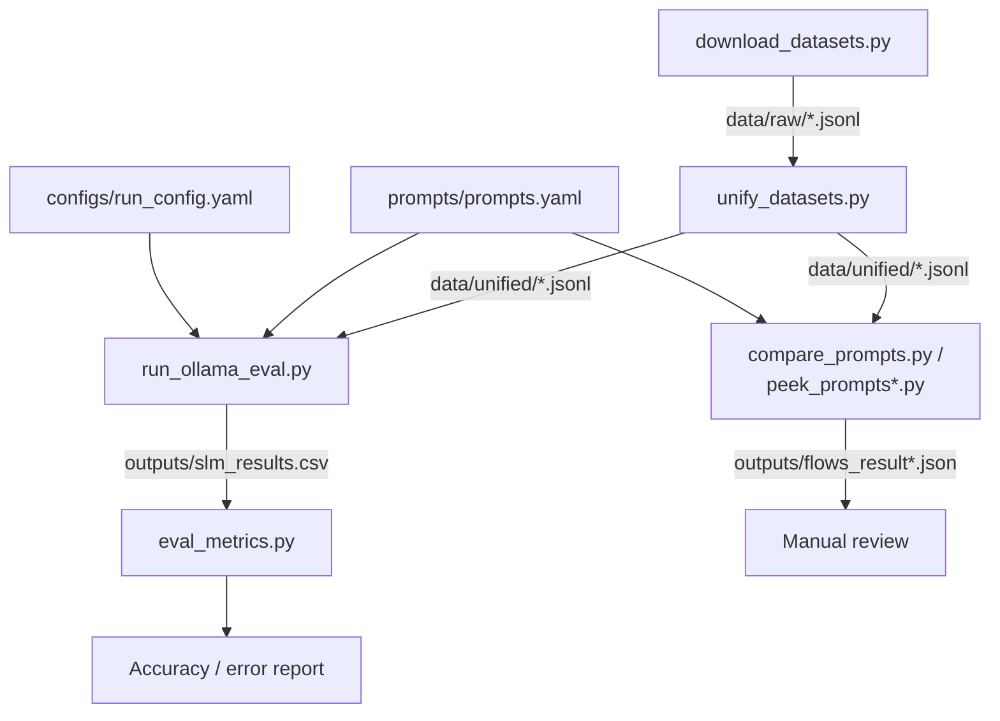

# Scripts

This folder holds the data pipeline and evaluation harness used to run the four prompting methods (Direct, Self-Ask, Program-of-Thought, Hybrid) against GSM8K and FinQA on local Ollama models.

## Pipeline scripts

Run these in order to reproduce a full evaluation pass:

1. **`download_datasets.py`** — Pulls raw GSM8K (`madrylab/gsm8k-platinum`) and FinQA (`ibm-research/finqa`) slices from Hugging Face and writes them to `data/raw/*.jsonl`.
2. **`unify_datasets.py`** — Normalizes the raw per-dataset formats into a single unified schema (`id`, `domain`, `dataset`, `question`, `context`, `numbers_json`, `answer`), writing to `data/unified/*.jsonl`. FinQA's table/pre/post text is linearized into `context`; GSM8K's `#### <answer>` suffix is extracted into `answer`.
3. **`run_ollama_eval.py`** — Reads `configs/run_config.yaml` (model + decoding options + input files) and `prompts/prompts.yaml` (prompt templates), selects a prompt per item's domain, calls the local Ollama server (`/api/generate`), extracts the final numeric answer from each completion, and writes one row per item to `outputs/slm_results.csv`.
4. **`eval_metrics.py`** — Reads `outputs/slm_results.csv` and prints an aggregate report: overall exact-match rate, average relative numeric error, and exact-match broken out per dataset.

To switch models or datasets, edit `configs/run_config.yaml` and re-run steps 3–4.

## Sanity / debug runners

These are standalone scripts for manually inspecting a small number of completions (not part of the main pipeline output). Each reads directly from `data/unified/` and `prompts/prompts.yaml`, calls Ollama itself, and writes a timestamped `flows_result<TIMESTAMP>.json` (raw prompts/completions/timings) for manual review:

- **`compare_prompts.py`** — Runs Self-Ask and Direct prompts on the first 5 GSM8K and 5 FinQA items; compares predictions to gold with 1% numeric tolerance.
- **`peek_prompts.py`** — Extends the above to all four prompt types (Direct, Self-Ask, PoT, Hybrid), selecting and executing the correct Python block per item.
- **`peek_prompts2.py`** — Revision of `peek_prompts.py`: reports by prompt ID only (drops the separate "style" field), adds a tighter 0.01% exact-match tolerance alongside a configurable relative-match tolerance.
- **`peek_prompts3.py`** — Adds extended metrics on top of `peek_prompts2.py`: EM@τ at multiple tolerances, LLM/program/total latency, program error rate, token counts, and accuracy per token/second.

## Flow

